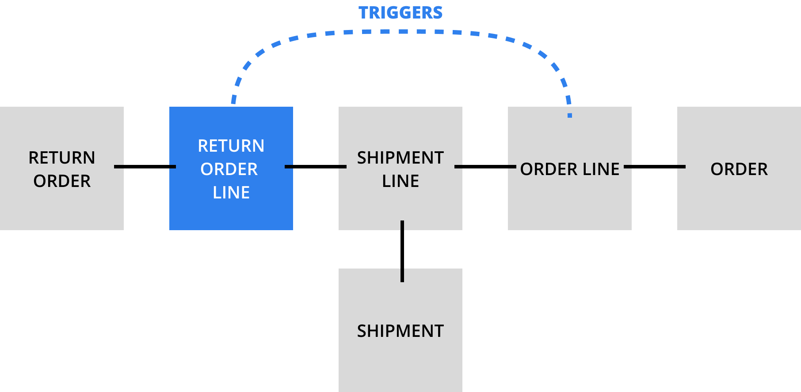

# Relationships and side effects

## Triggers

:::warning
There are **3 active triggers** on Return Order Line model to sync the shipped quantity of the related order line.  
They are fired on **create, update and delete** of the row at a database level so they **cannot be avoided**.
:::

### After create
After the creation of a new Return Order Line, the shipped quantity of the related order line is updated by decreasing the shipped quantity:  
`order_line.shipped_quantity -= return_order_line.qty`
### After update
After the update of a Return Order Line, the shipped quantity of the related order line is updated:  
`order_line.shipped_quantity -= return_order_line.new_qty + return_order_line.old_qty`
### After delete
After the delete of a Return Order Line, the shipped quantity of the related order line is increased by the deleted quantity:  
`order_line.shipped_quantity += return_order_line.qty`
